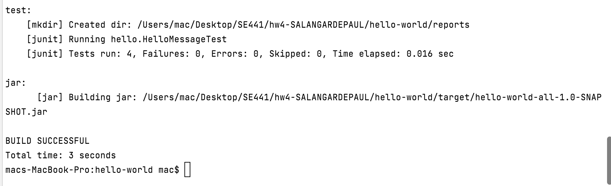

# Instructions
**TODO:** Sarah Alanqari. ID:2011624

**TODO:** Add your screen captures to a new directory called [images](images). -->Done

**HINT:** Embed your screen captures as requested in the sections below. You can embed the image using the following syntax:

```

```

The first argument is the Alt-text for the image. The second argument is the path to the image. Make sure your images are readable and that you save them in a JPG or PNG format.

# Ant+Ivy [40 pts]
- [5 pts] A screen capture showing the version of Ant that you installed and its install directory.


------------------------------------------------------------------------------------------------------------------------

- [5 pts] A screen capture showing the output generated by the `ant go-nodeps` execution during the Ivy installation.


------------------------------------------------------------------------------------------------------------------------

- [15 pts] A screen capture showing a successful build using the Ant+Ivy script.



------------------------------------------------------------------------------------------------------------------------

- [5 pts] A screen capture showing a successful execution of the JAR file created from the Ant+Ivy build.


------------------------------------------------------------------------------------------------------------------------

- [10 pts] Links to the complete and correct [hello-world/build.xml](hello-world/build.xml) and [hello-world/ivy.xml](hello-world/ivy.xml) files.

# Maven [30 pts]
- [5 pts] A screen capture showing the version of Maven that you installed and its install directory.


------------------------------------------------------------------------------------------------------------------------

- [10 pts] A screen capture showing a successful build using the Maven script.


------------------------------------------------------------------------------------------------------------------------

- [5 pts] A screen capture showing a successful execution of the JAR file created from the Maven build.


------------------------------------------------------------------------------------------------------------------------

- [10 pts] Links to the complete and correct [hello-world/pom.xml](hello-world/pom.xml) file.

# Gradle [30 pts]
- [5 pts]A screen capture showing the version of Gradle that you installed and its install directory.


------------------------------------------------------------------------------------------------------------------------

- [10 pts] A screen capture showing a successful build using the Gradle script.


------------------------------------------------------------------------------------------------------------------------

- [5 pts] A screen capture showing a successful execution of the JAR file created from the Gradle build.


------------------------------------------------------------------------------------------------------------------------

- [10 pts] Links to the complete and correct [hello-world/build.gradle](hello-world/build.gradle) file.
